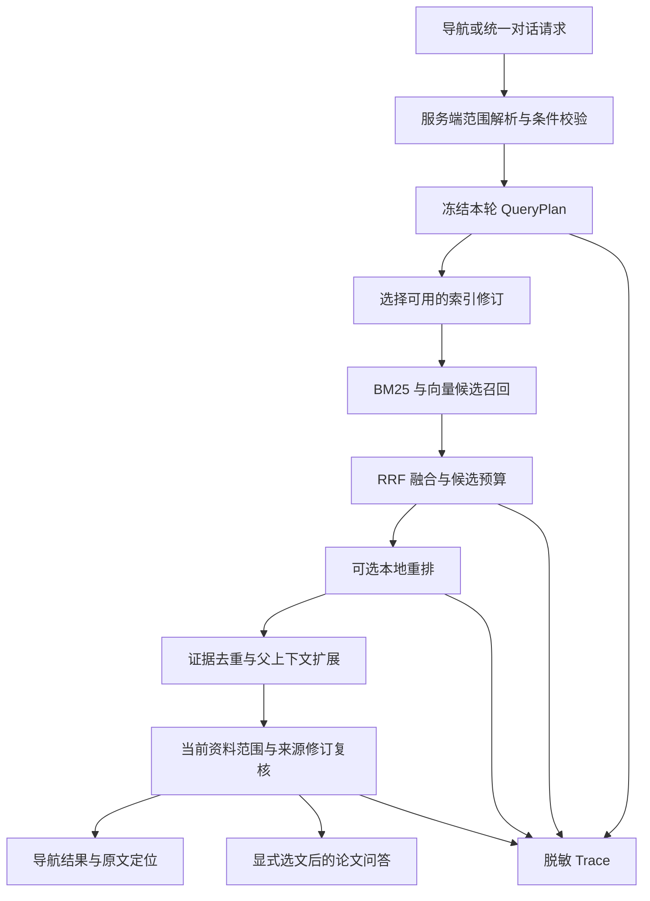

# 医学科研平台 RAG 升级设计

日期：2026-09-17  
状态：待实施设计；第一轮已实现内容单独列示。  
设计方式：主 Agent 统筹，三个子 Agent 分别审阅检索架构、对话与证据契约、评估与发布。

## 1 目标与取舍

将 SmartRecruit 中清晰的检索流程、结构化筛选、候选扩展、重排与原文回取，转化为医学平台可追溯、可评估的本地文献检索能力。以现有 FastAPI、SQLite、FAISS、BM25、RRF 为基础，复用锚点、研究上下文、统一对话、评估和 Trace 组件。

本轮设计不要求引入 Milvus、Elasticsearch、MongoDB。组件迁移的依据应是现有方案经过测量后暴露的能力缺口，不能以数据库数量衡量升级程度。若将来需要分布式索引，应在固定评测集和资源预算下另做技术选型。

推荐顺序：先完善现有检索入口的可观测性与边界，再接入父子块及版本索引，之后引入显式多轮条件，最后按评估证据决定默认启用范围。

## 2 当前状态

### 已有并可复用

- `/api/v1/document-navigation/search`：读取启用知识源下已解析、已建立 PaperQA2 索引的本地文档；BM25 或 FAISS 与 BM25 经 RRF 融合。
- 首轮升级：有界进程内索引快照、候选扩展、可选本地 CrossEncoder、失败回退、同文档相同正文去重、独立 `rerank_score` 和 `rerank_status`。
- `document_anchor`：文档锚点修订、来源页、文本项、引用锚点及片段。
- `unified_conversation` 与 `research_context`：统一科研对话、选定文档及研究上下文。既有 library 对话范围尚不能据此认定可执行全库论文问答。
- `evaluation`、`rag/trace.py`、`rag/shadow_release.py`：检索评估、医学专家 Shadow 契约、脱敏轨迹和发布判断基础。

### 仍待完成

- 索引缓存目前不跨进程、不跨重启；并发首次请求可能重复构建；块数预算不能替代字节预算。
- 当前导航按页与章节生成块，标识包含枚举位置，尚未形成稳定的版本化子块身份。
- 本地重排模型文件已存在，但指定后端环境缺少 `sentence_transformers`；真实推理及医学检索效果尚未验证。
- 公共重排超时在同步调用返回后检查，不能提前终止挂起的模型。
- 条件检查中固定年份和关键词命中不足以证明发表时间或研究设计，更不能证明医学结论真实。
- 现有测试验证接口与工程行为，不等同于医学检索质量评测。

首轮验证记录：128 项相关测试通过；最后局部调整后 18 项导航测试通过。本文未重新运行这些测试，历史结果见 `SMARTRECRUIT_NAVIGATION_UPGRADE.md`。

## 3 推荐架构



导航检索与生成答案分阶段发布。候选论文可以交给用户选择，或在以后明确设计的选文步骤中确认；不会因为检索升级就自动把全库所有论文交给 PaperQA2。

## 4 接口兼容原则

保留原有导航请求和响应字段。新增字段使用明确的默认值；老客户端省略新字段时保持原范围语义。新增条件对象在服务端模型中显式声明，不能依赖任意 `extra` 字段传入。统一对话使用严格请求模型，字段必须前后端同步发布或通过版本化接口启用。

检索分数、重排分数、来源定位状态、条件匹配状态分别表达，禁止合并成单个“可信度”。用户可见降级原因使用稳定错误码与简短说明，详细诊断写入脱敏运维轨迹。

本文下文出现的新对象、配置、表名和任务号均为设计建议，除明确列为现状外，不代表仓库已有实现。

## 5 父子块和证据定位

采用“子块召回和重排、父块提供有限上下文”的方案，借鉴 SmartRecruit 的检索粒度与展示粒度分离，医学问答不默认回取整篇全文。

1. 每个解析修订生成唯一规范文本序列。PDF 页是定位基本单元，章节关系作为附加结构；避免整页与整节重复建立两套相同正文。
2. 父块按真实章节或段落组组织，并设置上下文令牌上限。子块沿句子、段落边界切分，可先评估 300 至 500 tokens 的范围，最终参数由模型输入上限和固定评测确定。
3. 重排输入为问题、章节标题和子块。表格保留表头、行组及原表身份，避免将数值与单位拆散。
4. 缺少页码映射时返回 `section_only`；只有真实抽取的坐标才能写入 bbox。跨页父块保留多个位置。
5. 相同文档修订内完全相同或重叠证据可合并，但合并后保留全部 `locations`；不同论文不因相同措辞合并。同一论文的独立证据可以同时返回。

建议契约：

| 对象 | 关键字段 | 不变量 |
|---|---|---|
| 文档修订 | document_id、file_revision_id、file_hash、parser_version、parsed_hash | 文档 ID 不能代替正文版本 |
| EvidenceChunk | chunk_id、revision_id、parent_id、text_hash、section_path、chunker_version、token_count | 同一版本同一区间 ID 稳定，修改后生成新 ID |
| EvidenceLocation | anchor_revision_id、source_anchor_id、page_number、text item IDs、偏移与坐标、anchor_status | 复用既有锚点契约，不推测缺失位置 |
| NavigationEvidence | evidence_id、child_ids、matched_text、context_text、locations、index_generation、分数 | 上下文扩展不改变命中证据身份 |

`DocumentSourceTextItem.normalized_char_start/end` 与 `DocumentAnchorFragment.start/end_offset_utf16` 属于不同坐标体系。切片器必须保存规范化文本到原文的映射，再通过既有锚点服务重建引用。不得将 Python 字符索引直接当作浏览器 UTF-16 偏移。

旧响应保留单个 `location` 作为主位置，新增 `locations` 表达完整位置；旧客户端仍可读取主位置。旧引用继续指向原修订，不因索引重建静默跳到新正文。

## 6 持久化和增量索引

### 数据与发布

SQLite 保存导航修订、块元数据、索引代和构建任务；FAISS/BM25 是可重建的派生产物。先检索既有任务和文件修订模型，能复用的关系不重复建表。导航就绪状态逐步与 `paperqa_index_key` 分离，两个索引系统各自声明状态；迁移前保留旧资格规则。

首个持久化版本采用“复用未变化的向量，装配新一代完整索引”。这是增量编码、整代发布，不宣称已实现原位增量向量更新。

向量缓存键至少包含正文哈希、模型文件摘要、Tokenizer/规范化版本、维度和距离度量。索引清单按稳定块 ID 排序，避免数据库返回顺序变化导致无谓重建。

发布顺序：

1. 资料变更与构建任务在同一数据库事务记录；以资料修订和配置摘要实现幂等。
2. 后台工作器领取有租约的任务；限制构建并发、在途字节、输入 tokens。同一版本合并重复构建请求。
3. 新代写到同一文件系统的独立临时目录，核验向量数、块身份、维度、清单和校验和。
4. 完成目录原子发布后，以 SQLite 事务切换活动 generation；切换失败的新目录是可清理孤儿，不影响旧代。
5. 活动请求持有快照租约；旧代无引用后按保留策略清理。崩溃恢复核对活动指针与清单，不能将逐文件保存误认为整代原子发布。

### 范围与撤销

允许文档集合由服务端根据当前知识源、研究上下文、用户显式选择及实际权限计算。筛选必须发生在候选检索范围内，不能全库取固定 Top-K 后再过滤。

小规模先基于允许版本集合构造有界索引视图，复用持久化向量。以后若按知识源分片，需要另行规定不同分片的排名融合；不能直接比较各分片独立计算的 BM25 分数。

资料删除、禁用或撤销后立即从允许集合排除，在返回证据前再次核对。新索引尚未完成时可以检索仍有效的旧代，但不可返回已失效正文。没有可用旧代时明确报告部分范围不可用，不静默扩大范围。

### 缓存修正

首轮 4 个快照、4096 块预算只约束已缓存对象。后续需同时限制已缓存字节、在途构建字节、构建数量和等待队列。将全量读取正文、BM25 构建及全文指纹计算移到构建任务，避免向量命中缓存后仍在请求主线程执行这些操作。

## 7 候选预算与重排治理

### 明确阶段预算

区分 `dense_k`、`sparse_k`、`fusion_k`、`rerank_candidate_k`、`final_limit`、`context_token_budget`。`final_limit` 只控制最终 API 输出，不隐式提高模型或召回资源上限。

首轮通过 `max(各路配置, 扩展候选量)` 放大预算，便于先接通链路，但会抬高原 profile 配置。后续改成命名 profile 与显式上限：默认 profile 覆盖该入口允许的 final_limit；不满足预算关系的请求明确拒绝或返回不足条数及原因，不能悄悄扩大预算。倍率仅用于候选策略建议，受 profile 硬上限约束。

### 本地重排执行

- 依赖与模型文件在启动检查中验证，记录真实 manifest 摘要与截断配置；状态为 disabled、loading、ready 或 unavailable。
- 独立受监督进程加载一份本地模型，初期并发为 1，使用有界队列；拒绝超过候选数、tokens 和等待预算的任务。
- 区分排队耗时、推理耗时、端到端截止时间。截止时间到达即返回检索顺序；底层尚未结束的任务继续占据工作槽，不能虚假释放。
- 硬超时由监督器终止并回收工作进程后重建；连续失败触发熔断，探测成功后恢复。重排是可选阶段，其故障不能扩大资料范围或丢弃已有候选。
- 结构化回退码采用 model_unavailable、queue_full、deadline_exceeded、invalid_score、inference_error。仅在明确启用后执行，不在请求中下载模型。
- 首轮每请求创建的 RerankerService 缓存没有跨请求收益。先保持请求级缓存或去掉冗余缓存；如测量证明需要共享结果缓存，必须有界且包含查询、正文哈希、模型与配置身份。

模型目录存在、离线替身测试通过、真实模型可运行、质量有改善，是四个独立状态，发布报告分别记录。

## 8 有状态检索与多轮条件

无状态 `/document-navigation/search` 保持兼容。新增检索会话，用不可变修订保存用户明确提出的主题、范围和条件；导航使用检索会话，论文问答继续使用统一科研对话。

### 状态模型

建议引入：

- `RetrievalSession`：可选关联 conversation 和 research context，记录当前修订。
- `RetrievalStateRevision`：保存 parent revision、request ID、请求指纹、白名单操作和状态快照；对 `(session_id, revision)`、`(session_id, request_id)` 建唯一约束。
- 状态变更来源区分 `user_explicit`、`rule_extracted`、`model_proposed`。模型建议只有通过白名单和服务端校验后才能成为有效状态。

有效状态至少包括：主题、资料范围、可靠元数据过滤、语义约束，以及每个条件的来源轮次和原始表达。`document_ids=null` 表示未附加文档集合限制，空列表表示用户明确选择空范围，两者不可混用。

可靠元数据可以成为硬过滤；正文关键词、PICO 条件及未结构化研究设计先作为语义约束。以 2026-09-17 为解析基准时，“近三年”应明确展示为 2024 至 2026 三个自然年；运行时使用请求处理日期计算并冻结到该状态修订。“过去 36 个月”只有年份元数据时返回 `unsupported_precision`，不自动改写为三年。

### 操作与并发

允许操作限定为设置主题、增加/替换/删除条件、替换范围、重置条件和恢复历史修订。操作通过 condition ID 定位，避免一句“删除一个条件”误删同字段的多条规则。

- 未提及条件保持不变；“不限年份”显式删除年份，“改成近五年”仅替换年份。
- 撤销创建新修订，并按当前资料状态重新校验，历史修订不可变。
- `expected_revision` 采用比较并交换；并发修改只有一个成功，过期请求返回 409 及最新修订。
- 相同 request ID 与相同载荷重放结果；相同 ID 不同载荷返回 409。
- 先原子提交合法状态，再执行只读检索。检索失败不撤销用户已经明确提交的条件，响应分别表达状态变更与执行失败。
- 不清楚的指代返回 `clarification_required`，不改变状态。

建议新增接口：

```text
POST /document-navigation/sessions
POST /document-navigation/sessions/{id}/search
GET  /document-navigation/sessions/{id}
```

响应提供 state revision、effective state、applied changes、unresolved constraints、query plan、scope snapshot、execution status、warnings 和 results。

### 查询改写

模型适配器只允许输出独立检索查询、未解决指代、白名单状态操作建议和改写状态，不能直接输出答案。输入包括原问题、当前已验证状态和必要的用户历史，不把助手历史回答当作医学事实。

范围和权限永远取服务端有效状态。模型不能新增无来源的药物、患者群体或硬年份条件，也不能切换研究上下文。模型超时、JSON 错误或输出长篇回答时，使用“原问题＋已确定主题＋有效条件”的确定性模板回退。保存原问题、最终查询和变更摘要，便于检查查询漂移。

## 9 范围隔离及 PaperQA2 交接

执行检索前计算：

```text
有效资料 = 当前允许资料
         ∩ 启用知识源
         ∩ 已解析且导航索引就绪
         ∩ 研究上下文成员
         ∩ 显式 document IDs
         ∩ 显式 knowledge source IDs
```

项目当前没有完整租户权限系统；这里复用现有研究上下文成员检查，并给未来认证主体保留服务端接口。范围交集为空时返回空结果和原因，不退化为全库。显式文档不属于研究上下文时返回冲突，不能静默扩大范围。

缓存键包含最终资料及修订指纹。搜索期间资料被删除、禁用或移出研究上下文时，在返回前再次校验并删除失效结果，附 `scope_changed`。当前请求即使传 `indexed_only=false` 仍只读取已索引资料，兼容阶段应返回 `effective_indexed_only=true`，避免接口展示与行为不一致。

导航与 PaperQA2 通过显式选择交接：导航展示候选及来源，用户选择不超过现有上限的论文，服务端校验这些论文属于对应结果快照且仍有效，再将 document IDs 传入现有统一对话与 `PaperAnswerService`。交接载荷可以包括 retrieval session ID、state revision 和 selected document IDs。

PaperQA2 继续按当前选定论文入口执行。本设计不自动把整个导航范围加入问答，不开放现有 `scope_type=library`，也不宣称 PaperQA2 已执行与导航相同的硬过滤。

## 10 条件匹配与引用语义

当前 `verified/unverified` 只为兼容保留，新版使用以下状态：

- `metadata_match`：规范元数据字段满足条件。
- `metadata_mismatch`：可靠元数据明确不满足条件。
- `text_mention`：命中片段出现对应表述，只表示文本提及。
- `not_assessed`：当前资料和结构不足以判断。

每项条件匹配携带 condition ID、依据类型、来源字段和可选证据位置。年份仅读取规范发表日期/年份字段。正文出现 2025 年可能只是参考文献年份；出现 “RCT” 也可能是背景或否定句，均不能显示为医学事实验证通过。

定位结果逐步增加文档文件修订、锚点修订、来源锚点、evidence hash 和 `location_status`。状态为 exact、page_only、section_only、unavailable 或 stale。文档修订不一致时旧引用返回 stale 并保留历史文本，禁止重定向至新版相似内容。

## 11 评估数据与指标

复用 `app/modules/evaluation`、`app/rag/trace.py` 和现有医学 Shadow 契约，不采用 SmartRecruit 的单一招聘样例作为医学验收依据。

### 数据契约

建议扩展为 schema v2：case ID、数据集版本、划分、审核状态、问题和必要历史、问题类型、难度、可回答性、语料清单哈希、允许来源、预期条件、金标准证据组、参考 claims、标注者和裁决状态。

金标准证据使用稳定文档身份与正文哈希、页码/章节/锚点、0 至 3 级相关度、evidence role 和等价证据组。无答案题区分语料缺失、当前范围无证据和条件冲突；服务失败不能作为正确拒答。

建议以 40 题开发集和 80 题冻结测试集作为起步计划，并按论文或主题簇划分，覆盖术语与缩写、同义转述、研究设计、数字与单位、否定、跨文档比较、无答案、多轮条件和范围切换。这个规模是设计起点，不是当前已有数据或质量承诺。正式医学效果报告需要两名具备相应背景的标注者独立标注并裁决；此前只能产出工程探索报告。

### 指标

导航主指标：Evidence Recall@10、nDCG@10、MRR@10、定位正确率、scope leakage、重复率和结果填充率。Precision 同时区分文档去重口径和证据块口径；正式 Precision@K 以 K 为分母，结果不足 K 视为未命中，同时可附 `precision_returned`。

无答案题不混入普通 Recall 均值。页码指标必须使用文档身份与页码/锚点配对。排序消融要求固定候选集合；完整召回比较允许候选不同，但应标注联合候选池。使用按题配对 bootstrap 计算相对基线差值区间。

生成阶段以后单独验证 claim support、引用精确率与覆盖率、数字/单位/人群/时间点一致性、拒答 precision/recall 和专家判定关键误述率。Ragas 或 LLM judge 只能帮助发现问题，记录 judge 版本并抽样复核，不能代替医学专家标签。

### 消融组

| 组 | 方案 | 目的 |
|---|---|---|
| B0 | 可运行的升级前冻结代码和配置 | 历史基线 |
| B1 | 当前实现且关闭重排 | 第一轮控制组 |
| E1 | B1 加候选扩展 | 测召回预算影响 |
| E2 | E1 加真实 CrossEncoder | 测重排影响 |
| E3 | E2 加父子块 | 测证据粒度和上下文 |
| E4 | E3 加多轮条件 | 只在多轮题集验收 |

无法复现 B0 时从 B1 开始，报告中明确限制。冷热缓存只属于性能变量，排序应保持一致。

## 12 性能、故障与发布门禁

固定运行设备、依赖锁、模型文件哈希、语料哈希、配置和种子。分别测不同块规模、冷启动/预热/缓存命中/范围变化、并发量和候选预算。记录总耗时及解析、索引、Embedding、召回、重排阶段耗时，另记录锁等待、队列、RSS/VRAM 峰值、错误率、回退率和缓存命中率。成功与失败请求均计入统计。

故障集包括模型缺失、向量维度变化、NaN 或数量错误分数、Ollama 不可用、并发首次构建、资料删除、索引发布中断和模型挂起。目标设备的性能预算由真实测量后登记；预算为空不能宣称通过。

拟定门禁如下，均未达到或验证：

1. 工程门禁：范围泄漏、伪造定位、删除资料泄漏和来源身份改变为零；异常保留有效候选并报告降级。
2. 效果门禁：相对冻结基线，配对 nDCG@10 差值 95% 区间下界不低于 0，点估计建议至少增加 0.02；Evidence Recall@10 不下降超过 2 个百分点。具体阈值需在正式评审中批准。
3. 医学安全门禁：关键医学子集不新增严重错误；专家标注和裁决完成。
4. 性能门禁：满足已登记设备预算，不能只报告热缓存平均值。

发布顺序：离线回放 → 单机 Shadow → 明确会话的小范围启用 → 逐步扩大 → 满足正式门禁后才考虑默认启用。导航检索有独立发布门；只有接入答案生成时才需要 grounded generator 等完整问答发布门。

回滚分别控制候选扩展、导航重排、父子上下文、多轮条件和活动索引代。关闭全局 `RERANK_ENABLED` 不能回滚其他检索变化，因此需要导航专属开关、旧配置快照和旧发布包。任何范围或引用身份违规立即回滚；错误率、延迟和回退率按发布清单中的连续窗口触发停止扩大范围。

## 13 分期实施计划

### P0 语义修正和可观测性

- 将“近三年/RCT 已验证”改为元数据匹配、文本提及和未评估语义。
- 导航接入既有脱敏 Trace，记录配置、索引版本、阶段候选和耗时。
- 明确 profile 硬预算和 final limit，增加导航专属功能开关。
- 补齐本地模型依赖并做离线真实模型 smoke；失败仍保持回退。

验收：参考文献年份不触发发表年份匹配；否定 RCT 不显示验证通过；Trace 默认不保存问题和医学正文；缺模型、异常分数和超预算均有结构化状态。

### P1 父子块和来源锚点

- 建立版本化 EvidenceChunk 和位置映射，复用现有 Document Anchor。
- 子块召回/重排，父块限长展示；合并重复位置而非丢弃。
- 保留旧响应字段，新增 locations 与 location status。

验收：每个子块可回到正确修订和原文；跨页证据保留全部位置；章节未知页码不伪造；重排仅改变顺序。

### P2 持久化增量索引

- 引入导航索引 generation 和幂等构建任务。
- 复用未变化向量、整代原子发布、活动代切换和旧代清理。
- 删除/禁用即时从允许范围排除；索引发布失败保持旧代。

验收：进程重启不重新编码未变化资料；修改单文档只重新编码变化块；模型摘要变化生成新代；中断不破坏活动索引。

### P3 多轮条件和选文交接

- 检索会话、不可变修订、CAS/幂等和范围交集。
- 白名单查询改写、指代澄清和确定性回退。
- 导航结果快照向现有选定论文 PaperQA2 入口交接。

验收：三轮增删条件正确；撤销生成新修订；范围不能越界；空选择不退化全库；只允许所选论文进入回答引用。

### P4 评估和灰度发布

- 修正现有指标边界与评估 runner 重试语义。
- 建立冻结数据集、消融报告和失败清单。
- 实现独立重排进程、有界队列、截止时间、熔断和回滚演练。

验收：冻结报告可复现；所有失败纳入报告；满足已批准的质量和性能门禁后再扩大启用范围。

## 14 实施文件规划

建议在实施前按仓库现状再次核对命名，不机械创建重复模块：

- `app/modules/document_navigation/`：服务、状态、范围、查询计划和 API 契约。
- `app/modules/document_anchor/`：继续作为精确来源锚点的唯一权威。
- `app/modules/evaluation/`：扩展数据集、指标、runner 与报告，不建立另一套评估框架。
- `app/rag/`：检索 profile、Trace、重排进程适配和版本化索引基础能力。
- `alembic/versions/`：按阶段独立迁移，避免一个迁移同时引入索引、会话和评估全部状态。
- `tests/modules/document_navigation/` 与 `tests/modules/evaluation/`：单元、接口、故障与验收测试。

每个阶段完成后立即运行对应后端 pytest、Ruff 和 Mypy；涉及前端契约时再运行 typecheck、lint、test 和 build。仓库当前已有大量未提交改动，实施必须限定文件范围并在交付前核查 diff，避免覆盖既有工作。
